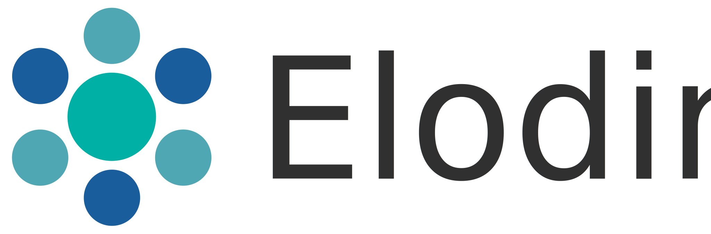

> **Warning**: Elodin is still WIP and experimental. It is not recommended to use it in production yet. There might be unknown bugs and the APIs might change rapidly.

Elodin is a small styling language that aims to provide a universal way to author user interface styles.

- **Component-based**:<br>Elodin styles are authored on component-base and fully encapsulated from other styles accounting for predictable styling without side-effects. It also enables automatic code-splitting where each component is rendered to a new file.
- **Quick learning-curve**:<br>The syntax is a mix of CSS and JavaScript with some concepts from ReasonML and thus already familiar to many developers. It is declarative and unlike CSS only supports **one** value per property.
- **Write once, use everywhere**:<br>Elodin compiles to a variety of different languages, platforms and libraries without having to change a single line. It's truly one file for all targets!
- **Type-safe properties**:<br>The compiler will validate every property-value pair and throw on invalid rules resulting in solid code and bulletproof output. If it compiles, it works!

</a> <a href="https://spectrum.chat/elodin"></a> 

## The Gist

```
variant Mode {
  Dark
  Light
}

style Button {
  justifyContent: center
  alignItems: flexEnd
  paddingBottom: 10
  paddingTop: 10
  fontSize: 15
  color: rgb(255 0 255)

  [Mode=Dark] {
    backgroundColor: black
  }

  [Mode=Light] {
    backgroundColor: white
  }
}

style Label {
  fontSize: 10
  color: grey
}
```

## Documentation

- [Into](https://elodin.dev/docs/intro/what-why)
- [Setup](https://elodin.dev/docs/setup/installation)
- [Language](https://elodin.dev/docs/language/styles)
- [Targets](https://elodin.dev/docs/targets/overview)
- [Plugins](https://elodin.dev/docs/plugins/color)
- [Advanced](https://elodin.dev/docs/advanced/specification)
- [API Reference](https://elodin.dev/docs/api/CLI)
- [Extra](https://elodin.dev/docs/extra/examples)

## Examples

- Web
  - [React](examples/react)
  - [Reason](examples/reason)
- Mobile
  - React Native (tbd)

## Tooling

- [VS Code Language Plugin](https://marketplace.visualstudio.com/items?itemName=robinweser.language-elodin)
- [Prettier Plugin](../packages/pretter-plugin-elodin)

## Contributing

Feel free to ask questions and give feedback on [Spectrum](https://spectrum.chat/elodin).<br>
For more information follow the [contribution guide](.github/CONTRIBUTING.md).<br>
Also, please read our [code of conduct](.github/CODE_OF_CONDUCT.md).

## License

Elodin is licensed under the [MIT License](http://opensource.org/licenses/MIT).<br>
Documentation is licensed under [Creative Commons License](http://creativecommons.org/licenses/by/4.0/).<br>
Created with ♥ by [Robin Weser](http://weser.io).
